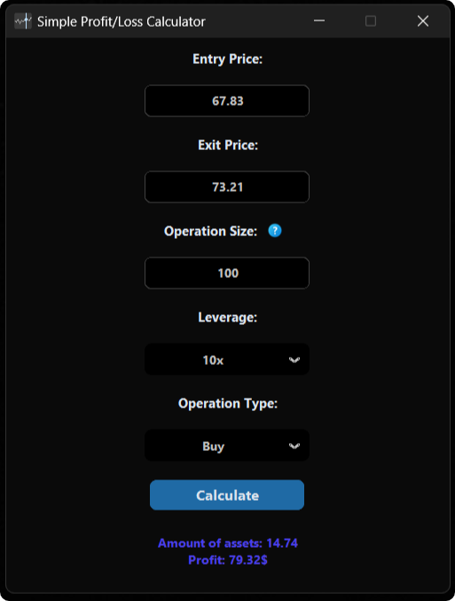
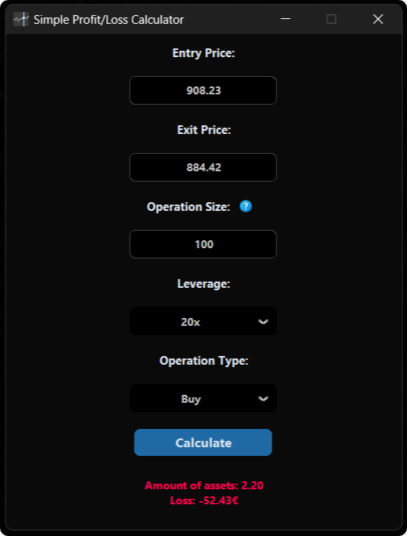

# 🚀 Simple Profit/Loss Calculator

**Simple Profit/Loss Calculator** is a user-friendly and efficient tool designed for beginner traders and investors to calculate profits or losses for their trades. Whether you’re managing risk or planning a new trade, this tool helps you stay in control of your financial strategies with just a few clicks.

This is my first project, and it came about a year ago when I started trading and needed a visual, easy-to-understand tool to calculate potential profits and losses. Before this, I was doing the calculations manually, and although there were some web alternatives, I needed a desktop solution that was simple.

For this project, I used **CustomTkinter** to improve the interface that I had previously developed in my personal version of this program.

---

## 🌟 Features

✅ **Easy-to-Use Interface**  
- Intuitive layout for hassle-free navigation.  
- Perfect for beginners.  

✅ **Customizable Inputs**  
- Enter your **trade size**, **entry price**, **exit price**.
- Adjust for **commission fees** and other costs.(Coming soon...)

✅ **Lightweight & Fast**  
- Optimized for quick performance on any system.  

---

## 🖥️ Screenshots


 
*Simple and intuitive interface*  

---

## 🛠️ Technologies Used

- **Python**: Core programming language.  
- **CustomTkinter**: Modern and sleek GUI design.  
- **Pillow**: For handling graphical assets.  

---

## 📥 Installation

Follow these steps to set up the application:

### 1. Clone the Repository:
```bash
git clone https://github.com/yourusername/SimpleProfitLossCalculator.git
cd SimpleProfitLossCalculator
```

### 2. Create Virtual Enviroment:
Make sure you have Python installed, then run:
```bash
python -m venv venv
```
Activate virtual environment on Windows.
```bash
venv\Scripts\activate
```
Activate virtual environment on MacOS and Linux:
```bash
source venv/bin/activate
```

### 3. Install Dependencies:
```bash
pip install -r requirements.txt
```

### 3. Run the Application:
```bash
python main.py
```

### 4. Build the Executable (Optional):
If you want a standalone executable:
```bash
pyinstaller --noconfirm --onedir --windowed --add-data "venv/Lib/site-packages/customtkinter;customtkinter/" --add-data "Assets;Assets" --icon "Assets/icon.ico" -n "P&L Calculator" main.py
```

---

## 📦 How to Use

1. **Launch the Application**.  
2. Fill in the following inputs:
   - Trade size.  
   - Entry price and exit price. 
   - Operation Size. (You can select your currency.)    
3. Click the **"Calculate"** button to view results

   

---

## 🚧 Future Enhancements

📝 Add parameters for commissions and fees.  
📊 Generate detailed reports for trades.  
🌐 Add support for different languages.  

---

## 📄 License

This project is licensed under the **MIT License**. See the [LICENSE](LICENSE) file for more details.

---

## 🤝 Contributing

I welcome contributions! If you’d like to contribute open a pull request. 

---

## 📧 Contact

If you have any questions, suggestions, or feedback, feel free to contact me.
